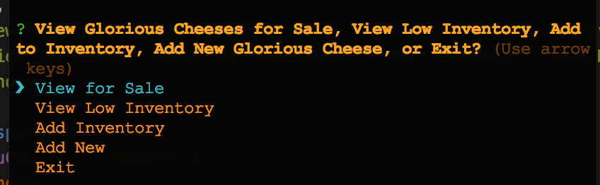
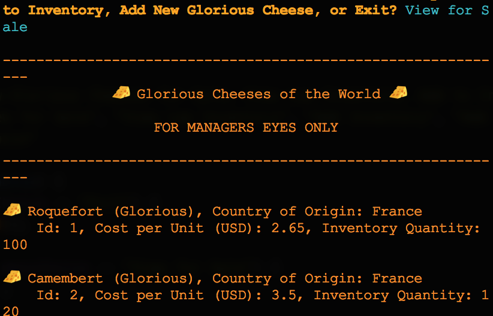
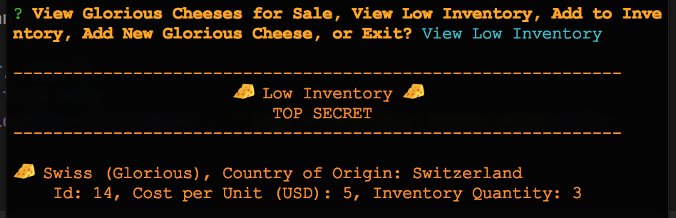
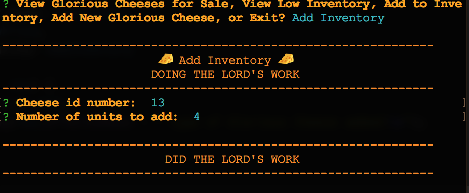
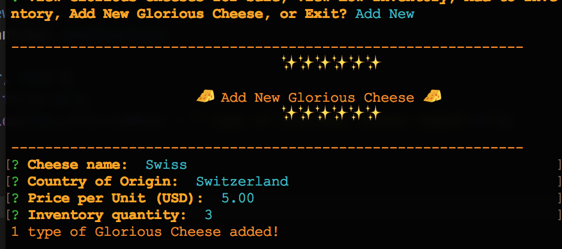

# Cheese-Shoppe

Cheese-Shoppe is a node.js/MySql app that allows cheese shoppers to order glorious cheeses from Glorious Cheeses of the World. Shoppers can view a menu of glorious cheeses held in a MySql database, order glorious cheeses if enough exists in database inventory, and exit the shoppe.

## Set-Up

1. Download files.
2. Start a server for MySql on port 3306.
3. In MySql, run cheeseSchema.sql then cheeseSeeds.sql to create and populate the database.
4. In the command line, `cd` into the root directory holding the files.
5. `npm install` to add dependencies.
6. `node customerOfCheese` to enter customer interface or `node managerOfCheese` to enter manager interface.

## Customer Interface

The cheese shopper is initially presented with the list of glorious cheeses in the database, their country of origin, their id number, and their cost per unit. This list is followed by the main menu.

The main menu allows cheese shoppers to order glorious cheeses by id number and number of units, view the list of glorious cheeses again, or exit the cheese shoppe (exits the node module).

When 'Order' is chosen, the cheese shopper is prompted for the id number and number of units to purchase. If there aren't enough units of cheese available in database inventory, the cheese shopper is directed back to the main menu. If enough units are available, the total cost is displayed and the cheese shopper is asked to confirm their order.

If order is confirmed, the database is updated with the new number of units available and the cheese customer is directed back to the main menu.

## Manager Interface

The cheese manager is initially directed to the main menu. From the main menu, the cheese manager can view all glorious cheeses for sale, view low inventory, add inventory, or add a new glorious cheese.

When 'View for Sale' is chosen, a list of all glorious cheeses in inventory is shown, including Country of Origin, Id Number, Price per Unit, and Number of Units in inventory.

When 'View Low Inventory' is chosen, a list of glorious cheeses with fewer than 5 units in inventory is shown.

When 'Add Inventory' is chosen, the cheese manager is prompted for the id of glorious cheese to add inventory to, then the number of units to add. When entered, the database is updated.

When 'Add New' is chosem the cheese manager is prompted for the new glorious cheese's name, country of origin, price, and number of units to stock. When entered, the database is updated.

